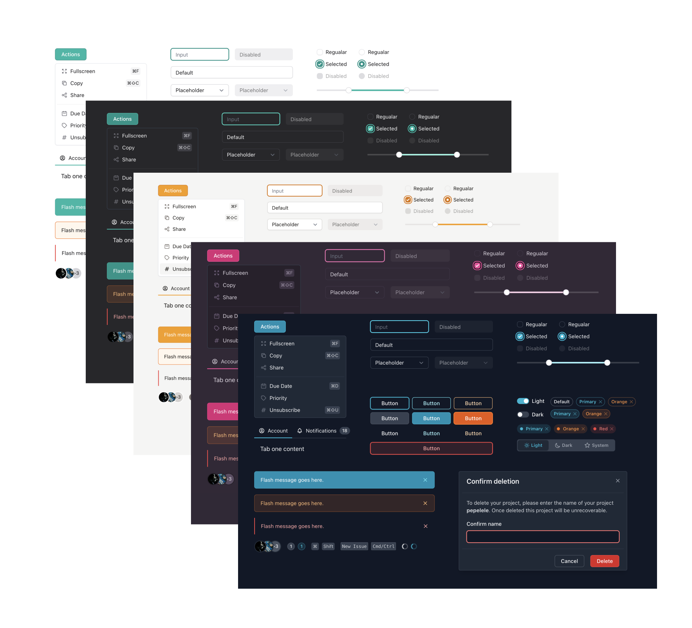

# DeepEcom UI

<div align="center">
Collection of Accessible React UI Components using TailwindCSS.

[](https://www.npmjs.com/package/@deepui/react)
[](https://www.npmjs.com/package/@deepui/react)

</div>



-  Documentation: [ui.deepecom.com](https://www.ui.deepecom.com/getting-started)
-  NPM: [@deepui/react](https://www.npmjs.com/package/@deepui/react)
## ✨ Features

- 📦 A set of accessibility React components & pre-designed headlessui + radix-ui components.
- 🛠️ Written in TypeScript.
- 🌙 Built-in Dark mode.
- 🌈 Powerful theme customization.

## Installation

```
npm i @deepui/core @deepui/react @tailwindcss/forms
```

**Yarn**

```
yarn add @deepui/core @deepui/react @tailwindcss/forms
```

## Development

**Prerequisites**: Node.js v12+, Yarn v1.22+

After cloning this repo, run:

1. `yarn boot` to install all dependencies & build all packages.
2. `yarn start` to run storybook
3. `yarn docs:dev` to run document website

## Contributing

All contributions are welcome. Even, if you notice wrong information, typos, or grammar mistake (English is not my primary language). Feel free to open an issue or create a pull request.

## Credit

This open-source UI component library was heavily inspired [PrimerCSS](https://primer.style/) & [ChakraUI](https://chakra-ui.com). I'd like to thank all of them for their amazing work.
## License

MIT License © 2021 [pepelele](https://github.com/pepelele)
